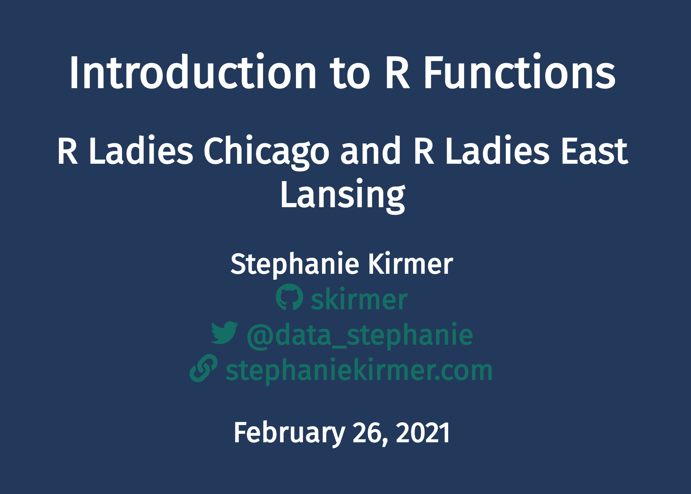

# Functions in R

This repo contains the materials for my 2 hour workshop on functions in R. Visit https://skirmer.github.io/presentations/functions_with_r.html to see the live version!

## Further Reading
* http://adv-r.had.co.nz/Functions.html
* https://r4ds.had.co.nz/functions.html
* https://nicercode.github.io/guides/functions/
* https://cran.r-project.org/doc/manuals/r-release/R-intro.html#Writing-your-own-functions
* https://r-pkgs.org/man.html
